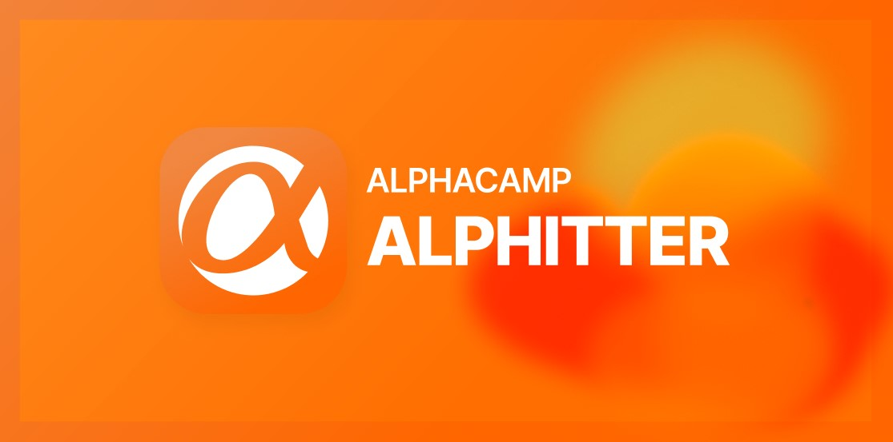
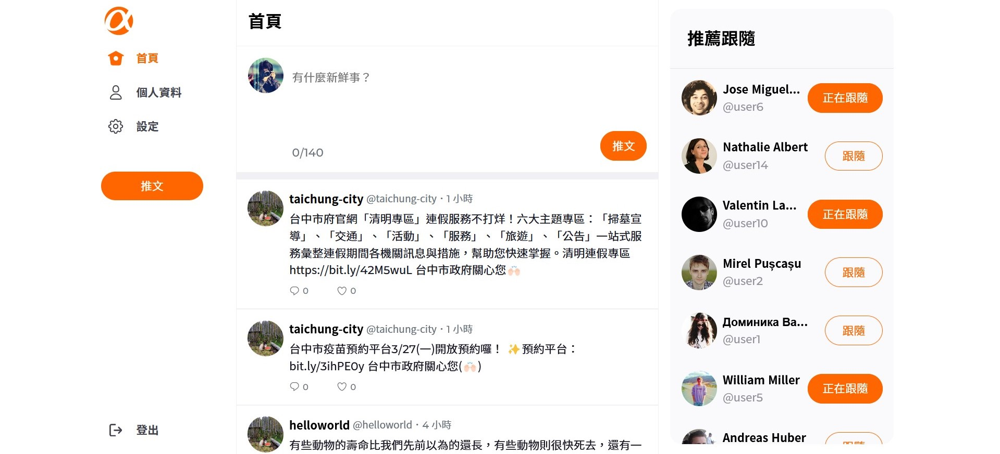

<div align="center">

# Alphitter (Alpha-twitter)

#### Simple Twitter Clone



</div>

### 📜 Table of Contents 

<details>
<summary>Click me</summary>

- [Alphitter (Alpha-twitter)](#alphitter-alpha-twitter)
      - [A Simple Twitter Clone](#a-simple-twitter-clone)
    - [📜 Table of Contents](#-table-of-contents)
  - [💡 Overview](#-overview)
    - [👀 Live demo: https://weilocus.github.io/twitter/](#-live-demo-httpsweilocusgithubiotwitter)
    - [🧩 Built with](#-built-with)
    - [💪 Our Team](#-our-team)
      - [Front-end team](#front-end-team)
      - [Back-end team](#back-end-team)
      - [Desktop Preview](#desktop-preview)
      - [Mobile Preview](#mobile-preview)
  - [✨ Features](#-features)
    - [User Features](#user-features)
      - [Home page](#home-page)
      - [Personal page](#personal-page)
      - [Settings page](#settings-page)
      - [Interact with other users](#interact-with-other-users)
    - [Admin Features](#admin-features)
  - [🚀 Run locally](#-run-locally)
  - [💻 Technologies](#-technologies)
    - [📦 File Structure](#-file-structure)
  - [🙏 Acknowledgements](#-acknowledgements)

</details>

## 💡 Overview

Alphitter is the final collaborative project for [Alpha Camp](https://www.linkedin.com/school/alpha-camp/?originalSubdomain=tw), which is developed within 2 weeks using Agile methodology by a four members team. Two of them are responsible for the front-end and two for the back-end. This repo shows the front-end part of the project. For the back-end code, please refer to [this link](https://github.com/yhhuangfrank/twitter-api-2020).

### 👀 Live demo: https://weilocus.github.io/twitter/

### 🧩 Built with


### 💪 Our Team

#### Front-end Team

- [Weii](https://github.com/WeiLocus)
- [Kelly CHI](https://github.com/KellyCHI22)

#### Back-end Team

- [Frank](https://github.com/yhhuangfrank)
- [Wei Lin](https://github.com/wego11ya)

#### Desktop Preview


#### Mobile Preview


## ✨ Features

- Publish tweets and see the updated feed immediately

  
  
- Like and leave comments to the tweets

  
 
- Customize easily your profile pictures and introduction 

  

### User Features

- Register as a new user or log in to your account to access the site
- Navigate through the site by clicking different links on the sidebar
- Click on Logout button in the sidebar to log out

#### Home Page

- Publish tweets and see the updated feed immediately 
- View all tweets on the site sorted by publish time from newest to oldest
- View a specific tweet and replies listed from newest to oldest

#### Personal Page

- View tweets from a specific user sorted from newest to oldest
- View replies from a specific user sorted from newest to oldest
- View a a specific user's liked tweets sorted from newest to oldest
- Edit the user account user name, introduction, cover photo, and profile picture

#### Settings page

- Manage your account, username, email and password settings

#### Interact with Other Users

- Reply to other users' tweets
- Click to like or unlike tweets
- Click to follow or unfollow users
- See the top 10 users that have the most followers on the 'Recommended' section

### Admin Features

- Log in as an administrator by using an administrator account
- View all tweets on the 'Tweet List' page
- Click to delete any tweet on the tweet list page
- Browse all registered users on the 'User List' page sorted by the number of tweets they published

## 🚀 Run locally

1. Clone the project to your local environment

```bash
$ git clone "https://github.com/KellyCHI22/twitter.git"
```

2. Open the project and type the following command in your terminal

```bash
$ npm install
```

3. Type the following command after finishing installing all the packages

```bash
$ npm run dev
```

4. Open your browser and navigate to the following path: `http://localhost:5173/twitter` 

5. Use this account to test a regular user account:

```
account: user1
password: 12345678
```

6. Use this account to test a administrator account:

```
account: root
password: 12345678
```

7. Type the following command to stop the dev server

```bash
ctrl + c
```

## 💻 Technologies

- node.js 16.16.0
- vite 4.2.1
- vite-plugin-svgr 2.4.0
- react 18.2.0
- react-dom 18.2.0
- react-router-dom 6.9.0
- react-spinners 0.13.8
- styled-components 5.3.9
- clsx 1.2.1
- axios 1.3.4
- eslint 8.36.0
- prettier 2.8.4

### 📦 File Structure

```
-- public
-- src
  |__ app.jsx
  |__ api
  |__ assets
    |__ icons
  |__ components
    |__ elements
    |__ layouts
  |__ contexts
  |__ pages
```

## 🙏 Acknowledgements

A million thanks to all the team members for successfully completing the project in just two weeks with the highest standard. It was a great pleasure and an honour to work with you guys!
